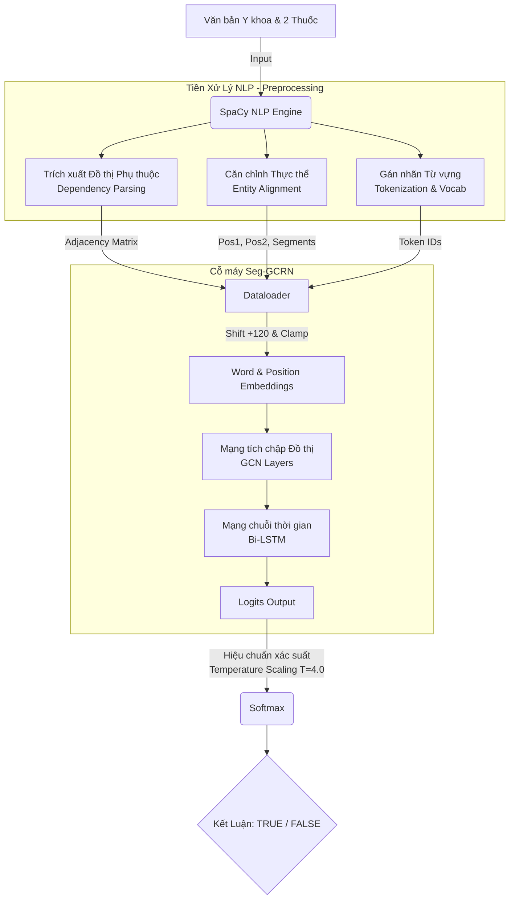

# 💊 Trích xuất Tương tác Thuốc (Drug-Drug Interaction) với Seg-GCRN

Dự án này ứng dụng mô hình Deep Learning **Seg-GCRN** (Segment Graph Convolutional Relational Network) để tự động phát hiện và cảnh báo tương tác thuốc (DDI) từ các văn bản y khoa, bệnh án hoặc tài liệu dược lý.

---

## 🏗️ Sơ đồ Kiến trúc Hệ thống (Pipeline Architecture)

Quá trình từ lúc nhập câu bệnh án thô đến khi AI đưa ra quyết định cảnh báo được mô tả qua sơ đồ luồng dữ liệu dưới đây:



## 🚀 Các Điểm Nhấn Công Nghệ & Tối Ưu Hóa (Key Features)

Dự án này được xây dựng theo chuẩn mực đánh giá mô hình của các bài báo khoa học (Paper) quốc tế, khắc phục triệt để các lỗi rò rỉ dữ liệu (Data Leakage) và Overfitting:

- **Stratified Split (Phân tầng dữ liệu):** Dữ liệu được chia Train (80%) và Validation (20%) bằng sklearn đảm bảo tỷ lệ nhãn True/False đồng đều ở mọi tập. Tuyệt đối cô lập tập Test (Unseen Data).
- **Cơ chế Dời trục Vị trí (Position Shift & Clamp):** Vị trí tương đối của từ ngữ được dịch chuyển +120 đơn vị và giới hạn chặt chẽ trong khoảng [1, 249] ngay tại DataLoader, đảm bảo sự đồng nhất tuyệt đối giữa Train và Inference.
- **Hiệu chuẩn Xác suất (Temperature Scaling):** Áp dụng hằng số nhiệt độ $T = 4.0$ vào hàm Softmax ở bước Inference để khắc phục hiện tượng "Tự tin thái quá" (Overconfidence) kinh điển của mạng Nơ-ron, giúp AI đưa ra % tự tin phản ánh đúng độ khó của câu hỏi.
- **Xử lý Mất cân bằng Class (Class Weights):** Sử dụng trọng số phạt [1.0, 6.3] trong hàm Loss để ép mô hình tập trung học các ca có tương tác (TRUE), hạn chế tối đa việc bỏ lọt cảnh báo nguy hiểm.

## 📂 Quy Trình Thực Hiện (Workflow)

**1. Chuẩn bị Dữ liệu (Data Preparation)**
Dữ liệu gốc dạng XML được chuyển đổi sang định dạng JSON gọn nhẹ. Sau đó đi qua pipeline SpaCy để trích xuất ma trận kề (Adjacency Matrix), vị trí tương đối (Pos) và Phân đoạn (Segments).

**2. Huấn Luyện (Training) - train.py**
- Mô hình học trên tập `train_80_split.json`.
- Sau mỗi vòng (Epoch), mô hình thi thử trên tập `val_20_split.json`.
- Cơ chế Checkpoint: Chỉ lưu lại bộ trọng số (Weights) có điểm Validation F1-Score cao nhất vào thư mục `models/best_seg_gcrn.pth`.

**3. Đánh giá Chung cuộc (Evaluation)**
Mô hình tốt nhất được load lại và chấm điểm duy nhất 1 lần trên tập đề thi đại học `test_processed.json`. Hệ thống tự động xuất ra:
- **Classification Report:** Precision, Recall, F1-Score cho từng Class.
- **Confusion Matrix:** Được vẽ và lưu thành ảnh `.png` trực quan hóa các ca đoán sai.

**4. Suy luận Thực tế (Inference) - predict.py**
Môi trường giả lập phòng khám. Cho phép người dùng nhập một câu tiếng Anh bất kỳ chứa tên 2 loại thuốc. AI sẽ quét qua toàn bộ Pipeline một lần duy nhất (Single Forward Pass) trong vài mili-giây và đưa ra cảnh báo True/False kèm độ tự tin đã hiệu chuẩn.

## 💻 Hướng Dẫn Chạy Cục Bộ (How to run)

**Bước 1: Huấn luyện mô hình**
*(Lưu ý: Dữ liệu đã được chia sẵn nằm trong thư mục `data/processed`)*
```bash
python train.py
```

**Bước 2: Chạy Demo dự đoán thực tế**
```bash
python predict.py
```